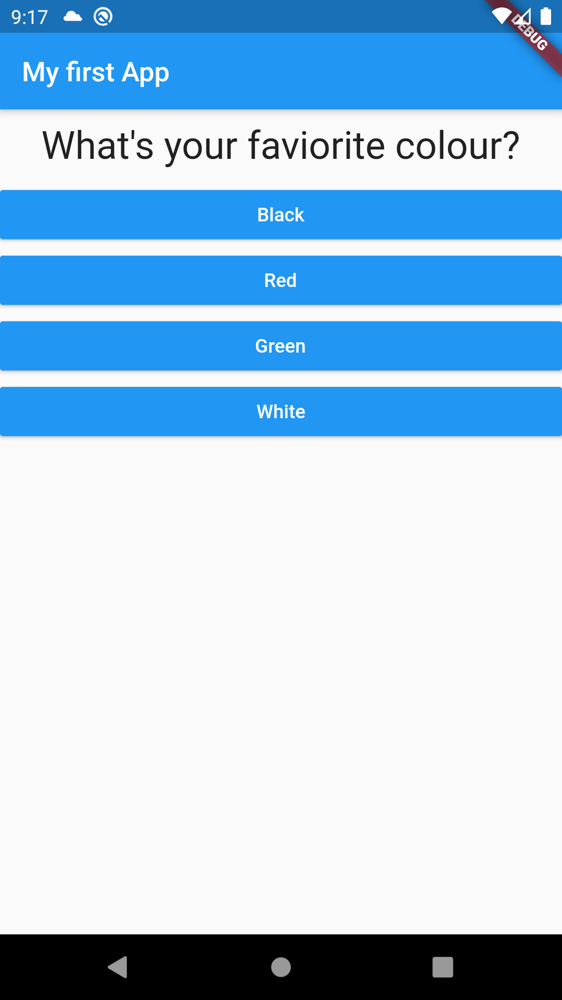

# quiz_app

I  am  on  my learning stage. And this is my first app  so dont judge  me...  :)

###### What I learnt from the project
* Dart basics
* Flutter basics
* Building a widget tree
* Column
* RaisedButton
* StatefullWidget, StateLessWidget
* Building custom StateLessWidget
* Splitting into Widget
* Map in Dart

  

